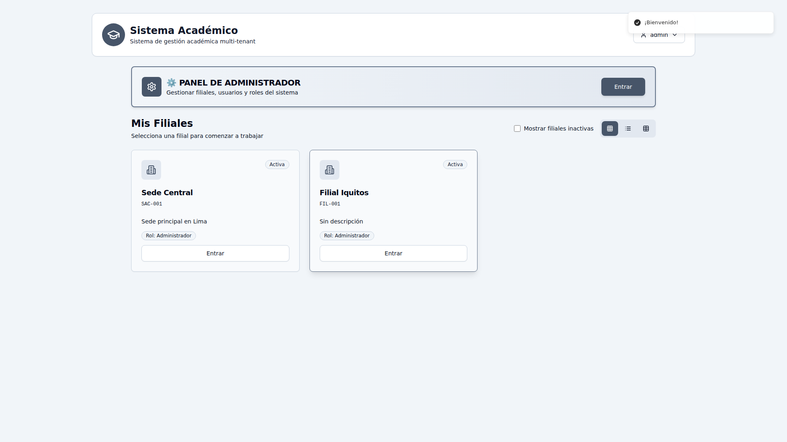

# Reporte de Pruebas - Aplicación Escolástica

**Fecha**: 26/11/2025, 2:53:34
**URL Base**: http://localhost:5000
**Carpeta de resultados**: `./test-results/test-2025-11-26T07-53-28`

---

## Resumen

- ✅ Pruebas exitosas: 3
- ❌ Pruebas fallidas: 0
- ℹ️  Información: 7

---

## Resultados Detallados

### 1. ℹ️ Screenshot: 01_pagina_inicial

**Estado**: INFO

**Detalles**: Guardado en: test-results/test-2025-11-26T07-53-28/screenshots/01_pagina_inicial.png

---

### 2. ✅ Carga de página inicial

**Estado**: PASS

**Detalles**: URL: http://localhost:5000

---

### 3. ℹ️ Título de página

**Estado**: INFO

**Detalles**: Sistema de Gestión Académica Multi-Tenant

---

### 4. ✅ Formulario de login presente

**Estado**: PASS

---

### 5. ℹ️ Screenshot: 02_formulario_login

**Estado**: INFO

**Detalles**: Guardado en: test-results/test-2025-11-26T07-53-28/screenshots/02_formulario_login.png

---

### 6. ℹ️ Screenshot: 03_login_completado

**Estado**: INFO

**Detalles**: Guardado en: test-results/test-2025-11-26T07-53-28/screenshots/03_login_completado.png

---

### 7. ℹ️ Screenshot: 04_despues_login

**Estado**: INFO

**Detalles**: Guardado en: test-results/test-2025-11-26T07-53-28/screenshots/04_despues_login.png

---

### 8. ✅ Login ejecutado

**Estado**: PASS

**Detalles**: Redirigido a: http://localhost:5000/dashboard

---

### 9. ℹ️ Módulo Probacionistas

**Estado**: INFO

**Detalles**: No se encontró el enlace al módulo

---

### 10. ℹ️ Screenshot: 09_estado_final

**Estado**: INFO

**Detalles**: Guardado en: test-results/test-2025-11-26T07-53-28/screenshots/09_estado_final.png

---

## Capturas de Pantalla

Todas las capturas de pantalla se encuentran en: `./test-results/test-2025-11-26T07-53-28/screenshots`

- 
- 
- 
- 
- 
