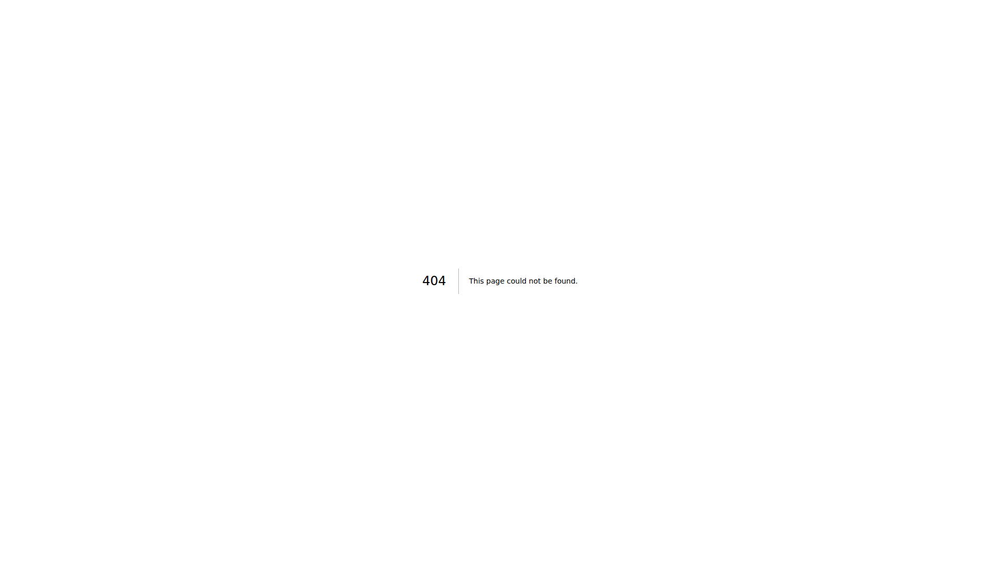

# Reporte de Pruebas - Aplicación Escolástica

**Fecha**: 26/11/2025, 2:55:39
**URL Base**: http://localhost:5000
**Carpeta de resultados**: `./test-results/test-2025-11-26T07-55-31`

---

## Resumen

- ✅ Pruebas exitosas: 3
- ❌ Pruebas fallidas: 0
- ℹ️  Información: 7

---

## Resultados Detallados

### 1. ℹ️ Screenshot: 01_pagina_inicial

**Estado**: INFO

**Detalles**: Guardado en: test-results/test-2025-11-26T07-55-31/screenshots/01_pagina_inicial.png

---

### 2. ✅ Carga de página inicial

**Estado**: PASS

**Detalles**: URL: http://localhost:5000

---

### 3. ℹ️ Título de página

**Estado**: INFO

**Detalles**: Sistema de Gestión Académica Multi-Tenant

---

### 4. ℹ️ Screenshot: 02_login_form

**Estado**: INFO

**Detalles**: Guardado en: test-results/test-2025-11-26T07-55-31/screenshots/02_login_form.png

---

### 5. ℹ️ Screenshot: 03_dashboard

**Estado**: INFO

**Detalles**: Guardado en: test-results/test-2025-11-26T07-55-31/screenshots/03_dashboard.png

---

### 6. ✅ Login ejecutado

**Estado**: PASS

**Detalles**: URL actual: http://localhost:5000/dashboard

---

### 7. ℹ️ Elementos de menú encontrados

**Estado**: INFO

**Detalles**: Total: 0

---

### 8. ℹ️ Screenshot: 04_probacionistas_direct

**Estado**: INFO

**Detalles**: Guardado en: test-results/test-2025-11-26T07-55-31/screenshots/04_probacionistas_direct.png

---

### 9. ✅ Módulo Probacionistas

**Estado**: PASS

**Detalles**: Accedido directamente por URL

---

### 10. ℹ️ Screenshot: 09_estado_final

**Estado**: INFO

**Detalles**: Guardado en: test-results/test-2025-11-26T07-55-31/screenshots/09_estado_final.png

---

## Capturas de Pantalla

Todas las capturas de pantalla se encuentran en: `./test-results/test-2025-11-26T07-55-31/screenshots`

### 01 pagina inicial

### 02 login form

### 03 dashboard

### 04 probacionistas direct

### 09 estado final

